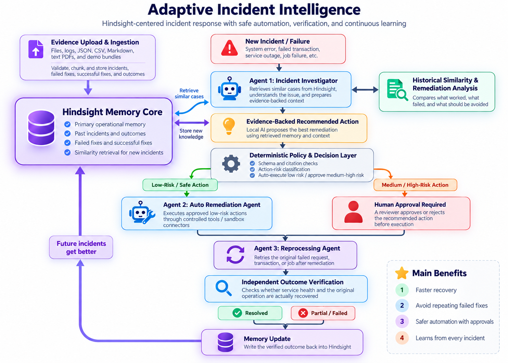
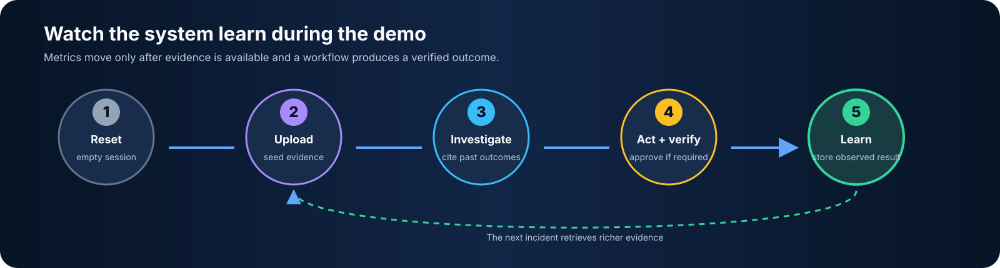

<div align="center">

# Adaptive Incident Intelligence

**Remember failed fixes. Recommend proven actions. Verify recovery.**

An evidence-backed incident response platform powered by Hindsight memory, guarded local AI, and independent recovery checks.


</div>

## The problem

Incident responders lose time reconstructing what happened before. Logs, tickets, attempted fixes, and final outcomes live in different places. This causes teams to repeat failed actions, trust incomplete recovery signals, and forget the sequence that actually solved an incident.

## Our solution

Adaptive Incident Intelligence turns every incident into reusable operational memory. It:

1. ingests past incidents, logs, and remediation outcomes;
2. retrieves the most relevant historical evidence with Hindsight;
3. uses a local LLM to explain a supported recovery action;
4. applies deterministic risk and approval rules in Python;
5. reprocesses the failed operation and independently verifies recovery; and
6. writes the observed result back to memory for the next incident.

The model proposes and explains. Python validates citations, classifies action risk, binds approvals, and controls execution.

## Why it stands out

| Capability | What it gives the responder |
| --- | --- |
| **Failure-aware memory** | Failed and partial fixes remain searchable, so the agent can avoid repeating them. |
| **Ordered evidence** | The system knows that a retry failed *before* a fix and succeeded *after* it. |
| **Safe action boundary** | Low-risk actions may run automatically; riskier actions pause for a named human decision. |
| **Recovery proof** | A successful tool response is insufficient. Service health and the original operation must recover. |
| **Measured learning** | The same held-out cases are rerun at every evidence and outcome checkpoint; the curve may rise, stay flat, or fall. |
| **Local-first stack** | Ollama and SQLite support a private demo without a paid model API; Hindsight is the primary memory path. |

## Architecture



### End-to-end request path

```text
Files / logs ──> validate ──> chunk ──> Hindsight memory
                                            │
New incident ──> investigator <─────────────┘
                       │
              evidence-backed proposal
                       │
        Python schema, citation, and risk checks
                       │
          ┌────────────┴────────────┐
 low-risk action on a       medium/high-risk action,
 Low/Medium incident        or High/Critical incident
       auto execute             human approval
          └────────────┬────────────┘
                       │
          reprocess ──> verify recovery
                       │
             store observed outcome
```

### Trust boundaries

- **Hindsight** stores and retrieves complete incident and outcome memories. Its native retrieval handles embedding and semantic similarity when configured.
- **Ollama + Qwen** produces a grounded explanation and proposal. Malformed, unsupported, or uncited output cannot reach an action tool.
- **Python policy** owns authorization. High/Critical incidents and medium/high risk actions require approval. Only low-risk actions on Low/Medium incidents can execute automatically.
- **Execution** uses simulation by default. A fixed sandbox connector is available for controlled integration tests.
- **Verification** checks service health and operation recovery independently, then records `SUCCESS`, `PARTIAL`, or `FAILED`.

See [architecture and trust boundaries](docs/architecture.md) for the component-level design.

## Live learning demo



The UI is designed to make the memory effect visible:

1. **Reset demo** rotates to a clean dashboard bank on the configured memory backend.
2. **Upload evidence** from a file or one of four demo bundles. With `MEMORY_BACKEND=hindsight`, Hindsight retains, embeds, and recalls that evidence.
3. **Open an incident** to inspect the cited history, avoided failed fix, confidence, and policy decision.
4. **Run the workflow in any order.** When a simulated incident has no supporting history, the workflow retains matching records from the bundled historical dataset, then recalls and investigates again. It selects source records by service, environment, and error code; expected test answers are never used to recommend an action. High/Critical incidents always pause for approval.
5. **Inspect the evaluation.** Hindsight evaluations run in the background and publish completed measurements of the same case set. They measure live recall and deterministic recovery validation, excluding model generation to avoid competing with retention on a local GPU. Workflow clicks never award points. The page polls for updates, shows case progress and errors, and provides Refresh metrics. Interrupted evaluations resume from the saved dashboard state.

The Memory Explorer shows uploaded history, pending reviews, unresolved investigation observations, and verified outcomes. Observations never count as successful recovery evidence. Failed and partial remediation outcomes remain searchable. The dashboard bank, upload index, pending reviews, completed workflows, and evaluation history survive API restarts through `WORKFLOW_DB_PATH`; Reset explicitly starts a new bank.

The starter bundle contains only customer and payment history. Other simulated incident families learn their source history on demand. Connector workflows require operator-supplied evidence. If evidence is still insufficient, the incident remains retryable and its investigation is retained. Model abstention or an unsupported proposal falls back to a disclosed recommendation only when validated recovery history supports it.

## Demo walkthrough

For a short judge demo:

1. Open **Overview** and select **Reset demo**.
2. Select **Load evidence**, then load the **Starter incidents** bundle.
3. Open a low-risk incident to show evidence retrieval and automatic simulated remediation.
4. Open a critical incident to show the human approval gate and bound reviewer decision.
5. Complete both workflows, then open **Evaluation** to show the stepwise improvement graph.
6. Open **Memory Explorer** to show the newly stored outcomes and failed-remediation evidence.

> All incidents, action tools, service checks, and recovery outcomes in this repository are synthetic or simulated.

## Current prototype

- **Web platform:** React, TypeScript, Vite, React Query, and a typed FastAPI client.
- **API:** incident queue, investigations, workflow execution, approvals, evaluation, reset, upload, and deletion endpoints.
- **Memory:** live Hindsight banks for dashboard ingestion, recall, and outcome feedback, with SQLite as a development backend.
- **Ingestion:** validated JSON, CSV, Markdown, logs, and text PDFs with bounded failed-remediation chunks.
- **Reasoning:** deterministic baseline plus guarded Ollama synthesis using `qwen3.5:9b`.
- **Workflow safety:** durable approval state, audit events, execution checkpoints, and at-most-once connector receipts.
- **Dataset:** 18 historical incidents, 54 ordered remediation outcomes, and 12 held-out cases across six failure families.
- **Validation:** 116 Python tests and 15 frontend tests passing at this checkpoint.

## Severity and action risk

These are separate decisions:

| Dimension | Values | Purpose |
| --- | --- | --- |
| Incident severity | Low, medium, high, critical | Sets urgency; High and Critical always require approval. |
| Action risk | Low, medium, high | Medium and high require approval regardless of severity. |

A critical incident with a low-risk remediation still requires review. A medium-severity incident also requires approval if its proposed action is medium or high risk.

## Quick start

### Requirements

- Python 3.10+
- Node.js 20+ with npm
- Ollama with `qwen3.5:9b` for local model reasoning
- A running Hindsight service for the primary memory integration

The rules engine and SQLite backend remain available when Ollama or Hindsight is unavailable.

### 1. Install the backend

```powershell
python -m venv .venv
.venv\Scripts\python.exe -m pip install -r requirements.txt
Copy-Item .env.example .env
```

For a local Docker-free run, keep these values in `.env`:

```dotenv
MEMORY_BACKEND=sqlite
LLM_PROVIDER=ollama
LLM_MODEL=qwen3.5:9b
```

For Hindsight, follow [the Hindsight setup guide](docs/hindsight-setup.md), then set `MEMORY_BACKEND=hindsight`.

### 2. Start Ollama

```powershell
ollama pull qwen3.5:9b
ollama serve
```

If `ollama serve` says port `11434` is already in use, Ollama is already running. Verify it from the project root:

```powershell
.venv\Scripts\python.exe -m llm.check --generate
```

### 3. Start the API

Run this from the project root:

```powershell
.venv\Scripts\python.exe -m uvicorn api.app:create_app --factory --reload --port 8000
```

API documentation: [http://127.0.0.1:8000/docs](http://127.0.0.1:8000/docs)

Readiness check: [http://127.0.0.1:8000/api/health](http://127.0.0.1:8000/api/health). When Hindsight is configured but offline, the API remains available and reports `status: degraded`; memory operations stay disabled until the service reconnects.

`/health` is an alias for `/api/health`. Vite proxies both health paths to the API during development.

To verify actual retain, recall, approval, outcome feedback, evaluation, and restart persistence against your configured Hindsight/Ollama services, run `.venv\Scripts\python.exe -m tests.live_hindsight_learning`. It writes synthetic records into a new isolated Hindsight bank and saves a JSON report under `.runtime/learning-check-*/report.json`.

### 4. Start the dashboard

In a second terminal:

```powershell
Set-Location frontend
Copy-Item .env.example .env -ErrorAction SilentlyContinue
npm install
npm run dev
```

Dashboard: [http://127.0.0.1:5173](http://127.0.0.1:5173)

### Docker option

```powershell
docker compose up --build
```

Docker is optional for local development. The compose configuration preserves runtime databases through mounted storage and is ready for the same environment variables.

## CLI and evaluation

```powershell
# Deterministic development run with persistent local memory
.venv\Scripts\python.exe main.py --engine rules --memory sqlite

# Read-only investigation
.venv\Scripts\python.exe main.py investigate --input data/examples/incident.json

# Approval-gated workflow
.venv\Scripts\python.exe main.py run --input data/examples/high-risk-scenario.json --memory hindsight --interactive

# Reproduce the local-model evaluation
.venv\Scripts\python.exe -m evaluation.evaluate_memory --engine ollama --output reports/local-ollama.json

# Audit dataset balance, split integrity, and fixture hashes
.venv\Scripts\python.exe -m evaluation.dataset_audit --output reports/dataset-audit.json
```

### Measured learning result

The dashboard is the authoritative comparison. It reruns all 12 held-out incidents against an empty bank and after every evidence or verified-outcome checkpoint. It reports action accuracy, recommendation coverage, retrieval precision, failed-fix avoidance, the exact recommendation for each case, and the recalled source IDs. No fixed improvement percentage is claimed in this README because results depend on the evidence actually uploaded and the configured model.

## Tests

```powershell
# Backend
.venv\Scripts\python.exe -m unittest discover -s tests -v

# Frontend
Set-Location frontend
npm test
npm run lint
npm run typecheck
npm run build
```

## Repository map

```text
agents/       investigation, remediation, reprocessing, verification
api/          FastAPI routes, runtime wiring, request/response models
memory/       Hindsight, SQLite, retrieval, and memory writing
services/     workflow orchestration, ingestion, approvals, persistence
tools/        policy, simulation, connectors, and action tools
schemas/      validated incident, proposal, workflow, and outcome models
evaluation/   memory comparison, metrics, and dataset audit
frontend/     live operations dashboard
data/         synthetic history, held-out cases, and examples
docs/         setup, architecture, implementation, and phase notes
tests/        backend integration and safety tests
```

## Documentation

- [Getting started](docs/getting-started.md)
- [Architecture and trust boundaries](docs/architecture.md)
- [HTTP API](docs/api.md)
- [Implementation reference](docs/implementation.md)
- [Local model and GPU setup](docs/local-model.md)
- [Hindsight setup](docs/hindsight-setup.md)
- [Ingestion and failed-remediation memory](docs/phase-7-ingestion.md)
- [Workflow persistence](docs/phase-8-workflow-persistence.md)
- [Sandbox connectors and idempotency](docs/phase-9-connectors.md)
- [Measured evaluation](docs/phase-6-evaluation.md)
- [Build phases](docs/README.md)

## Scope

This is a hackathon prototype. Production deployment would require organization-specific action policies, authenticated role management, secrets handling, production connectors, observability, and validation against real incident data.
