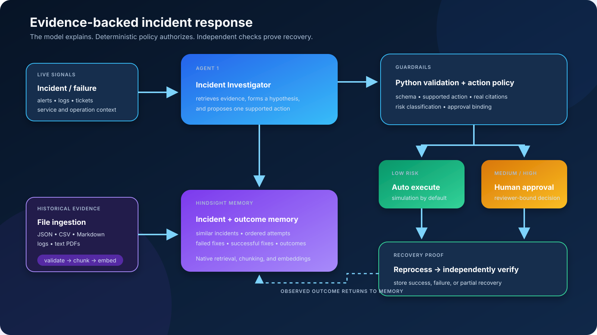

# Architecture and component boundaries

[Documentation index](README.md) | [Project overview](../README.md)

## Target flow

1. Historical incident files are validated and retained as complete records. Failed and partial outcomes are also indexed as traceable remediation chunks; Hindsight performs native chunking and embedding.
2. An incident arrives with service, symptoms, error, environment, and operation context.
3. The Incident Investigator consults Hindsight memory and historical similarity/remediation analysis.
4. It returns a likely cause, recommended action, evidence, and confidence assessment.
5. The Action Decision Layer checks an explicit action policy.
6. The Auto Remediation Agent executes an allowed low-risk action, or waits for human approval for a medium/high-risk action. Rejected actions stop here.
7. After successful remediation, the Reprocessing Agent retries the failed transaction, request, or job.
8. Outcome Verification checks whether the underlying problem and failed operation recovered.
9. Resolved, failed, and partial outcomes are written to Hindsight for later investigations.

Human approval authorizes a remediation; it does not itself fix the incident. Approved actions still need execution before reprocessing. This makes the approval branch in the supplied architecture explicit.

## Roles and current implementation

| Architecture role | Code location | Status |
| --- | --- | --- |
| Incident Investigator | `agents/incident_investigator.py`, `agents/llm_investigator.py` | Deterministic baseline plus guarded Ollama synthesis |
| Historical similarity and remediation analysis | `agents/remediation_memory.py`, `memory/memory_retriever.py` | Implemented for mock, SQLite, and Hindsight protocol clients |
| Incident memory | `memory/hindsight_client.py`, `memory/sqlite_client.py`, `memory/hindsight_adapter.py` | Mock, SQLite, and official Hindsight SDK paths implemented |
| Action Decision Layer | `tools/risk_classifier.py` | Implemented simulation allowlist and bound approvals |
| Auto Remediation Agent | `agents/auto_remediation.py`, remediation service/tools | Implemented for local simulation |
| Reprocessing Agent | `agents/reprocessing.py`, `tools/reprocessing_tools.py` | Implemented with remediation prerequisite |
| Outcome Verification | `agents/outcome_verifier.py`, `services/verification_service.py` | Independent simulated health and operation checks |
| Memory update | All memory clients through the shared protocol | Verified simulated outcomes written by `IncidentWorkflow` |
| Web API | `api/app.py`, `api/runtime.py` | Typed incidents, investigation, workflow, approval, upload, reset, and evaluation endpoints |
| File ingestion and failed-remediation index | `services/ingestion_service.py`, `schemas/ingestion.py` | JSON validation, bounded chunks, local persistence/search, and Hindsight retention |

The Remediation Memory module supports the investigator. It is distinct from the Auto Remediation Agent, which executes approved actions.

## Design principles

- **Preserve order:** an action can fail before a fix and succeed afterward.
- **Keep evidence:** recommendations retain incident IDs and complete action histories.
- **Allow uncertainty:** return insufficient evidence when comparable history cannot support a recommendation.
- **Separate recommendation and authorization:** every current investigation result has `execution_authorized: false`.
- **Verify recovery:** a successful tool response alone is not proof that the failed operation recovered.
- **Retain every outcome:** future memory should contain failures and partial recoveries as well as successful fixes.
- **Constrain the model:** schema validation, allowlisted actions, real citation checks, and historical sequence support run in Python.

The hackathon's action tools are simulated. PIN reset is labeled low risk only within the synthetic demo; it is not a production authorization policy.

## Simulation and execution boundaries

`tools/simulation.py` owns explicit scenario state. It models tool acknowledgements separately from service health and operation recovery, so acknowledgements cannot establish success by themselves. The workflow returns SUCCESS when both checks pass, PARTIAL when only one passes, and FAILED when neither passes. Failed remediation skips reprocessing.

`Outcome.tool_result` retains tool acknowledgements while `Outcome.result` retains the observed step outcome. `IncidentMemory.final_outcome` records overall recovery. Thus a failed retry can remain FAILED in action history while overall recovery is PARTIAL because the service itself recovered. Root causes written from investigations remain historical hypotheses, not independently established causes.

The optional bearer-token configuration derives reviewer identity on the server. Without it, the application remains a local demo. The simulator is a test fixture, not a production connector. Workflow state, approval records, audit events, execution checkpoints, and connector receipts persist in SQLite.

The HTTP layer keeps simulator truth on the server. A browser selects a named demo scenario and never supplies the required remediation action, expected result, or health observation.
